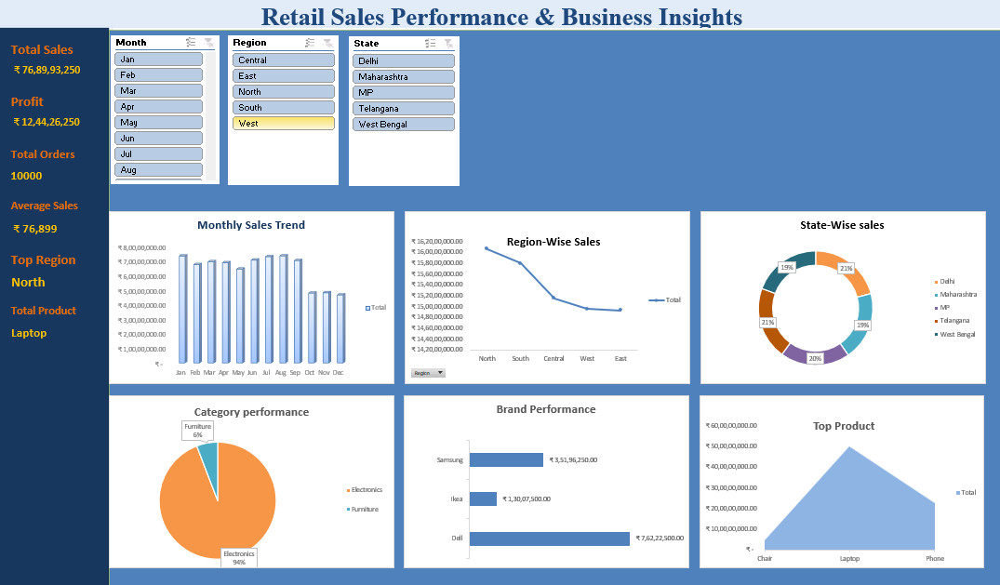

# 📊 Retail Sales Dashboard (Excel)

## 📌 Project Overview

This project analyzes retail sales data using Microsoft Excel. The dashboard provides insights into sales performance, profit, orders, products, and regional performance through interactive visualizations.

## 🛠️ Tools Used

- Microsoft Excel
- Pivot Tables
- Pivot Charts
- Slicers
- Conditional Formatting
- Excel Formulas
  
## 📈 Key KPIs

- Total Sales
- Total Profit
- Total Orders
- Average Sales
  
## 📊 Dashboard Features

- Monthly Sales Analysis
- Region-wise Sales Performance
- Product Category Analysis
- Brand-wise Performance
- Top Products
- Interactive Slicers

## 💡 Business Insights

- Identified the top-performing regions.
- Compared sales across different product categories.
- Analyzed monthly sales trends.
- Found the best-performing products.

## 📷 Dashboard Preview

## 📁 Files Included

- Retail_Sales_Dashboard.xlsx
- Dashboard.png
